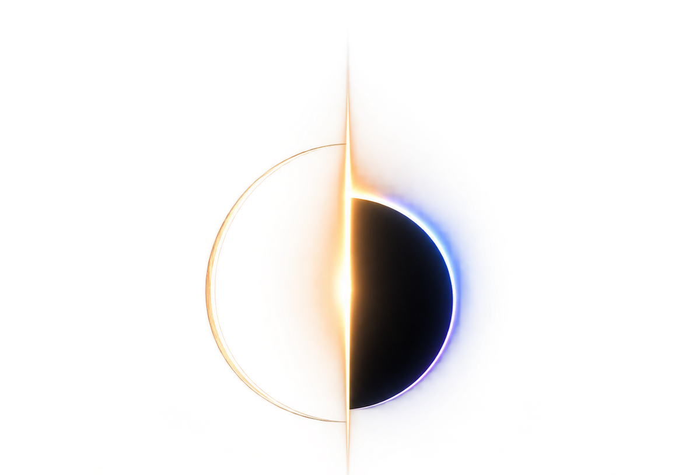
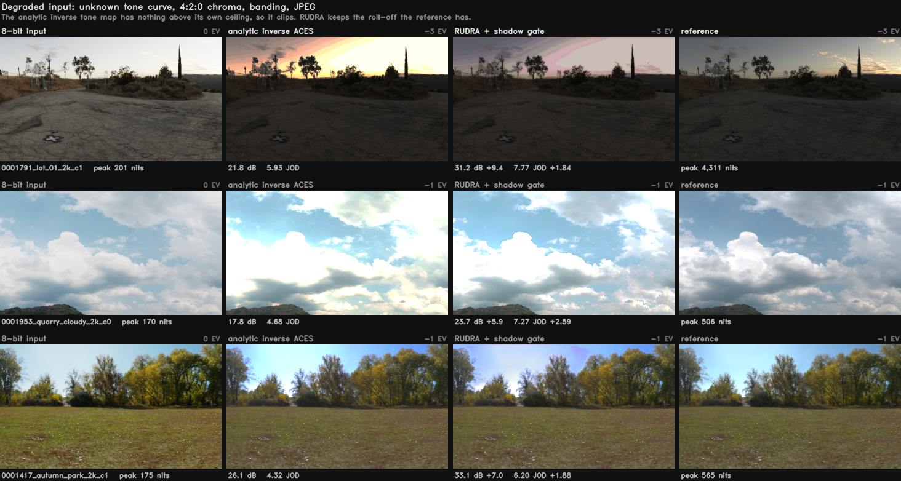
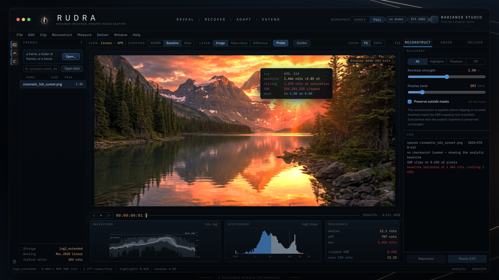

<p align="center">
  
</p>

<h1 align="center">RUDRA</h1>

<p align="center">
  <b>R</b>adiance <b>U</b>niversal <b>D</b>ynamic <b>R</b>ange <b>A</b>dapter<br>
  Turns 8-bit SDR footage into scene-linear HDR, and tells you where it did it.
</p>

<p align="center">
  
  
  
  
  <a href="https://github.com/fxtdstudios/RUDRA/releases"></a>
  <a href="https://github.com/fxtdstudios/RUDRA/actions/workflows/native.yml?query=branch%3Anative"></a>
  <a href="https://github.com/fxtdstudios/RUDRA/actions/workflows/native.yml?query=branch%3Anative"></a>
  <a href="https://github.com/fxtdstudios/RUDRA/actions/workflows/native.yml?query=branch%3Anative"></a>
</p>

---

**Contents:**
[What it does](#what-it-does) ·
[See it](#see-it) ·
[Results](#results) ·
[Install](#install) ·
[Quick start](#quick-start) ·
[The Studio](#the-studio) ·
[Video delivery](#video-delivery) ·
[Batch queues](#batch-queues) ·
[Stills and sequences](#stills-and-sequences) ·
[Validation diagnostics](#validation-diagnostics) ·
[Desktop app](#desktop-app-in-progress) ·
[Documentation](#documentation) ·
[Licence](#licence)

---

## What it does

An 8-bit frame throws away everything above the clip. RUDRA puts it back where
the SDR mapping was non-invertible (blown highlights, crushed shadows) and
leaves every other pixel to the analytic inverse, unchanged.

It ships as a Studio that runs in the browser and a delivery CLI.

**Scope.** RUDRA is one thing: SDR to HDR for any image or video, whatever made
it, whether a camera, a phone, an archive or any generative model. It works on
pixels, not on a model's latent space. The per-backbone VAE decoders (Flux,
Wan, LTX, SDXL, Qwen, Klein) and the latent-conditioning research pipeline are
**paused** as of 23 Sep 2026. Their code stays in `rudra/` and `training/` and
their results in [`STATUS.md`](STATUS.md), but they are not part of the product
and are not maintained.

---

## See it



Three held-out frames. Unknown tone curve, 4:2:0 chroma, banding, JPEG: the
condition real footage arrives in. The analytic inverse has a hard ceiling and
clips into it, so the sky goes flat. RUDRA keeps the roll-off the reference has.
HDR columns are stopped down by whole stops so a browser can show them, and the
exposure comes from the reference alone, so nothing is flattered by its own
output.

---

## Results

429 held-out frames, native 1280×720, scene-linear with diffuse white at 1.0.
Whole scenes are held out, so no scene appears on both sides of a split.

| Condition | Method | PU21-PSNR | CVVDP (JOD) |
|---|---|---:|---:|
| **hard** | analytic baseline | 25.92 | 7.362 |
| **hard** | **RUDRA + shadow gate** | **27.15** | **7.751** |
| clean | analytic baseline | 45.99 | 9.448 |
| clean | **RUDRA + shadow gate** | **46.06** | **9.561** |

`hard` is the deployment condition. `clean` is well-graded input, which the
analytic baseline already handles well. The gated configuration is the only one
we have scored that beats the baseline in **both** conditions on **both**
metrics.

> **Read both metrics together.** The ungated model gains +1.43 dB on degraded
> input and *loses* 3.0 dB on clean input, where CVVDP puts the same gap at
> −0.046 JOD, far below a just-noticeable difference. The two instruments
> disagree by two orders of magnitude on identical frames. Quoting the gain
> without the loss, or the clean PSNR without the JOD beside it, misrepresents
> the result in opposite directions.

> **Known limitation (23 Sep 2026).** On SDR made with a tone curve and codec the
> training corpus never used (Hable + H.264 CRF 28, same 429 frames), the shipped
> model scores below the analytic baseline. The next corpus (v4c) draws its SDR
> from a family of curves and codecs to close this. Numbers and plan:
> [`STATUS.md`](STATUS.md).
>
> **24 Sep 2026: not closed yet.** The first models trained on v4b and v4c do not
> beat the analytic baseline on the bench, including the out-of-generator
> condition, so the shipped model is unchanged. The gates and what is being
> checked next are in [`STATUS.md`](STATUS.md), which also holds the release
> definition: the seven conditions a model must pass before it replaces the
> shipped one.

Full tables, the failure analysis, and how to recompute every number:
[`docs/RESULTS.md`](docs/RESULTS.md).

---

## Install

**Desktop beta (no Python).** From
[Releases](https://github.com/fxtdstudios/RUDRA/releases), the latest
pre-release: for Windows x64 `RUDRA-<version>-windows-x64-setup.exe`, which
installs for your user (no administrator prompt) with the model and the Visual
C++ runtime included, or the portable ZIP beside it; for Apple silicon
`RUDRA-<version>-macos-arm64.dmg`. Details: [`docs/BETA.md`](docs/BETA.md).

**Python package.** Requires Python 3.10 to 3.13. CUDA is optional: everything runs on CPU, slower.
FFmpeg is needed for video, not for stills.

```bash
git clone https://github.com/fxtdstudios/RUDRA.git
cd RUDRA
pip install -e .
(cd checkpoints && sha256sum -c SHA256SUMS)
```

---

## Quick start

Open the Studio. It loads the shipped checkpoint and opens a browser tab:

```bash
python ui/server.py
```

Convert a complete SDR clip to HDR10, keeping its audio:

```bash
rudra video input.mp4 --output delivery/master_hdr10.mp4 \
    --checkpoint checkpoints/sdr2hdr_shadow_v1.pt --device cuda
```

Reconstruct a frame or a folder of frames:

```bash
python training/infer_sdr2hdr.py input/ --output-dir out/ \
    --image-checkpoint checkpoints/sdr2hdr_shadow_v1.pt --recovery-mode all
```

---

## The Studio



Drop a frame or a shot. The network runs once per frame on the GPU and hands
the page raw fields. Everything after that composes on your own GPU, so the
controls move at frame rate.

| Layer | What it shows |
|---|---|
| **Compare** | RUDRA, the analytic baseline, or a draggable wipe between them |
| **False colour** | luminance zones in nits, against a diffuse white of 203 |
| **Difference** | how far RUDRA moved from the baseline; black means it changed nothing there |
| **Probe** | one pixel: baseline, RUDRA, the delta in stops, and whether the SDR clipped there at all |
| **Scopes** | waveform, RGB histogram and vectorscope, all in nits on a log axis, computed from the frame's own pixels |
| **Frame** | what the frame contains: MaxCLL, MaxFALL, the share above 1 000 nits, and the share the SDR actually clipped |

The bar along the bottom is the colour pipeline, and it is always on: what the
input is being read as, the working space, what the viewer is doing to the
picture, and what the master will be written as. It warns when the frame
carries pixels above the peak the viewer is showing, because an SDR monitor
clipping a highlight looks exactly like a highlight that was never there.

The surround is a neutral grey on purpose, because a tinted one biases the
judgement of the picture inside it.

Playback runs at the footage's frame rate, with a read-ahead in front of the
playhead, and the transport reads timecode.

### Mastering from the Studio

**Master EXR** writes OpenEXR in ACES 2065-1 or linear Rec.2020 directly to an
absolute **Render folder** on the computer running the Studio. Choose
**Current image** or **All loaded frames (sequence)**, then set the render name
and starting frame. A sequence named `shot` starting at 1001 writes
`shot.001001.exr`, `shot.001002.exr` and matching JSON sidecars, using the
loaded frame order and one frozen copy of the current grade.

- Master keeps the source resolution and does not trigger a browser download.
- Flat highlights are settled: above the anchor's knee the expansion curve is
  steep enough to turn the source's one-code grain into tens of nits, so where
  the source is flat the master's luminance is smoothed (hue, edges and glints
  untouched). On a sunset plate, flat sky at source luma 0.95 to 0.98 went from
  17.0 to 1.8 nits of grain; `tools/measure_highlight_grain.py` measures any
  plate. `settle_grain: false` in the master parameters turns it off.
- Existing outputs stop the render before processing; files are never overwritten.
- Keep the Studio and the browser open until the render completes.
- If a sequence stops, completed frames remain on disk. Choose the remaining
  inputs and the matching start number to continue, or use a fresh render folder.

---

## Video delivery

`rudra video` converts a complete SDR clip. Run `python -m rudra.video` with the
same arguments if the CLI is not installed. It requires FFmpeg/ffprobe with
`libx265` and `zscale`; ProRes also needs `prores_ks`.

### Presets

Select a preset with `--format`:

| Preset | Output | Signal | Alpha |
|---|---|---|---|
| `hdr10` (default) | MP4/MOV/MKV, HEVC 10-bit | BT.2020 PQ, static HDR10 metadata | No |
| `hlg` | MP4/MOV/MKV, HEVC 10-bit | BT.2020 HLG | No |
| `prores422` | MOV, ProRes 422 | BT.2020 PQ | No |
| `prores422hq` | MOV, ProRes 422 HQ | BT.2020 PQ | No |
| `prores4444` | MOV, ProRes 4444 | BT.2020 PQ | Straight alpha |

```bash
rudra video input.mp4 --output delivery/broadcast_hlg.mp4 --format hlg \
    --checkpoint checkpoints/sdr2hdr_shadow_v1.pt --device cuda
rudra video input.mp4 --output delivery/editorial.mov --format prores422hq \
    --checkpoint checkpoints/sdr2hdr_shadow_v1.pt --device cuda
rudra video transparent.mov --output delivery/composite.mov --format prores4444 \
    --alpha-mode straight --checkpoint checkpoints/sdr2hdr_shadow_v1.pt --device cuda
```

### Input

Supported: progressive, square-pixel, constant-frame-rate SDR video with even
dimensions. The rational frame rate and frame count are preserved, video start
time is normalized to zero, and audio stays aligned to the video. Audio outside
the video interval is trimmed; all input audio streams are copied by default.
Use `--audio aac` when the input audio codec cannot be copied into MP4.

Colour tags determine the input transfer, primaries, YUV matrix and range.
Missing or unsupported tags require explicit overrides, for example
`--input-transfer rec709 --input-primaries rec709 --input-matrix bt709 --input-range limited`.
Only use those overrides when they describe the source.

Rejected rather than silently changed: HDR, alpha-bearing, interlaced, rotated,
anamorphic and variable-frame-rate inputs. The exception is straight alpha with
the ProRes 4444 preset. No preset carries subtitles.

### Output and QC

HDR10 is 10-bit HEVC, BT.2020/PQ, with measured MaxCLL/MaxFALL and mastering
display metadata; `--peak-nits 1000` selects the mastering peak. Every preset is
published only after checking dimensions, every frame timestamp, frame count,
colour tags, HDR metadata, audio alignment and a complete decode. A matching
`.json` sidecar records the checkpoint hash, settings, per-frame statistics and
QC results. Existing outputs are never overwritten.

### HLG

HLG uses BT.2100's inverse OOTF followed by its OETF, with zero reference black,
the selected peak and the corresponding system gamma (1.2 at 1000 nits). It
does not merely relabel PQ pixels. Saturated values outside legal HLG scene RGB
receive a common RGB gain reduction. HLG has no HDR10 static SEI.

### ProRes and alpha

ProRes stores PQ colour tags, while the mastering and content-light analysis
remains in the sidecar. ProRes MOV's `nclc` atom may omit a separate range flag;
conversion uses limited video range.

`prores_ks` accepts 10-bit colour and alpha input planes, so a 4444 stream
decoding to 12-bit colour or configured for 16-bit alpha storage does not
restore precision lost at its input. Alpha bypasses reconstruction and grading.
Every decoded output alpha pixel is checked against the input with a tolerance
of 128/65535 (two 10-bit steps), so arbitrary 16-bit alpha is **not lossless**.
Premultiplied sources must first be unpremultiplied; `--alpha-mode straight`
declares the supplied interpretation.

### Performance and options

- CPU is the default device; select `--device cuda` explicitly when available.
- Full source dimensions are kept, using 512-pixel tiles by default;
  `--tile-size 0` runs untiled when memory permits.
- Temporary 16-bit PNGs are spooled to disk rather than keeping a whole clip in
  RAM. Use `--work-dir` to select a disk with space.
- A single `rudra video` job is not resumable; use a [batch queue](#batch-queues)
  for per-clip resume.
- `--shadow-smoothing 0.8` smooths the scalar shadow gate and resets it at
  detected hard cuts. It does not blend image pixels and is not a validated
  temporal model. Off by default.

---

## Batch queues

Save a queue as `queue.json`. Paths resolve relative to that file. Defaults and
per-job `options` accept the same option names as `rudra video` (underscores or
hyphens), without the leading `--`.

```json
{
  "version": 1,
  "defaults": {
    "checkpoint": "checkpoints/sdr2hdr_shadow_v1.pt",
    "device": "cpu",
    "format": "hdr10"
  },
  "jobs": [
    {"input": "clips/shot01.mp4", "output": "masters/shot01.mp4"},
    {"input": "clips/shot02.mp4", "output": "masters/shot02.mov",
     "options": {"format": "prores422hq"}}
  ]
}
```

```console
rudra batch run queue.json
rudra batch status queue.json
rudra batch run queue.json --retry-failed
```

- Jobs run sequentially. Progress and errors are saved atomically in
  `queue.json.state.json`; a process lock prevents two runners using the same queue.
- Repeating `run` verifies the SHA-256 hashes of completed video/report pairs,
  sources and weights before skipping them.
- Failed jobs remain visible and require `--retry-failed`; other jobs continue.
  The command returns nonzero if any job is incomplete.
- Keep the queue unchanged after starting it; use a new filename for a revised
  queue, and separate output paths across different queues.
- Resume is **per clip**: interrupted clips restart from frame one. An existing
  output or report is never overwritten.
- If a crash occurs during final publication or before completion is saved,
  review and relocate that job's output/report pair before retrying. Temporary
  folders may remain after a hard process termination.

---

## Stills and sequences

```bash
python training/infer_sdr2hdr.py input/ --output-dir out/ \
    --image-checkpoint checkpoints/sdr2hdr_shadow_v1.pt --recovery-mode all
```

Inference writes float EXR delivery masters at 203 nits per stored unit. TIFF
outputs keep the network's separate 10,000-nit convention. For a nested input
sequence, pass the corresponding output shot directory to delivery. No GPU is
required.

---

## Validation diagnostics

### Quality benchmark

Run a fixed, scene-balanced sample without consuming the final test set:

```console
python training/quality_benchmark.py --manifest outputs/finetune_views_20260920/data/manifest.jsonl --checkpoint checkpoints/sdr2hdr_shadow_v1.pt --out outputs/quality_diagnostic_new --scenes 12
```

The output directory must be new. The tool freezes source and checkpoint hashes,
scores the shipped model against the analytic inverse-ACES baseline at native
resolution on CPU, and writes `REPORT.md`, `summary.json` and `scores.jsonl`.
It selects one frame per validation scene by a stable hash, then tests clean and
seeded degraded inputs. It reports PU21-PSNR, real ColorVideoVDP image JOD, and
shadow/highlight region errors, with paired bootstrap intervals. Missing metrics
remain unavailable; proxy values never enter the comparison.

This is an image-quality diagnostic, not a motion benchmark or an external comparison.
Candidate training assessment and final held-out testing remain separate. Do not
read a small validation sample as proof of general superiority.

### Recovery ablation

Isolate the residual recovery paths on the exact same frozen sample:

```console
python training/recovery_ablation.py --benchmark outputs/quality_benchmark_20260920 --out outputs/recovery_ablation_new
```

This verifies the original source, checkpoint and implementation hashes, reuses
the original baseline and all-recovery scores, and measures highlights-only,
shadows-only and recovery-off with real ColorVideoVDP. The new output directory
holds paired comparisons and an ablation report. No inference defaults or
training settings are changed; confirm findings on broader validation before
promoting a different recovery policy.

---

## Desktop app (in progress)

A native RUDRA for Windows, Linux and macOS, with no Python at runtime: Qt 6
for the interface, a QRhi viewer on each OS's native GPU API (Direct3D 12,
Metal, Vulkan, OpenGL fallback) with HDR output, a C++20 core, and inference
through LibTorch (CUDA, MPS) and ONNX Runtime (DirectML, Core ML, ROCm,
OpenVINO). It lives in [`native/`](native/README.md) on the `native` branch.
The browser Studio and the Python CLI stay as they are and remain the
reference every native module is tested against; the state before that work
is tagged `webui-v1`.

Done:
- [x] Model package export: TorchScript and ONNX, checked against the Python
- [x] C++ core: composite, measurements, grade controls, HDR10/HLG, metadata
  sidecars and EXR/ACES/OCIO writers, each matching the Python it ports
- [x] Inference through LibTorch (CUDA) and ONNX Runtime (DirectML) on Windows GPUs
- [x] HDR output on Windows: Direct3D 12 scRGB and HDR10 on an HDR display
- [x] GPU composite on Direct3D 12, Direct3D 11, Vulkan and OpenGL
- [x] Stills, masters, QC, queues and sequences with no Python installed
- [x] The viewer: HDR swapchain, fit, zoom, pan, wipe, scopes, guides, frame cache
- [x] The Qt UI: the Studio's layout, actions, panels, undo, Deliver tab and
  checkpoint manager
- [x] Video delivery: HDR10, HLG and ProRes masters with audio, QC before
  publishing, video jobs in a resumable queue
- [x] The whole workflow scripted, passing on Linux
- [x] macOS on Apple silicon (macOS 27): the app builds with `scripts/native_app.sh`
  and its 36 Qt tests pass, including the scripted workflow (model, open, scrub,
  grade, compare, measure, master) and a movie opened, scrubbed and queued for
  HDR10; the model package exports there with TorchScript exact and ONNX at
  5.4e-5 of eager PyTorch
- [x] Beta packaging (0.9.0-beta.1): `scripts/package_mac.sh` makes a
  self-contained RUDRA.app in a DMG, `scripts/PACKAGE_WINDOWS.ps1` an installer
  (setup.exe) and a portable ZIP with Qt, ONNX Runtime and DirectML beside the
  exe; a `v*` tag builds them on
  GitHub and publishes a pre-release ([`docs/BETA.md`](docs/BETA.md))
- [x] Windows beta built on a Windows PC: `RUDRA-0.9.0-beta.1-windows-x64-setup.exe`
  (Inno Setup, per-user, Start menu, uninstaller) and the portable ZIP, with the
  MSVC runtime from Visual Studio's redistributable folder; the package starts
  and reads its model from where it is
- [x] CI green on Windows, macOS and Linux: every job of the `native` workflow
  passes on all three (run 36907549070, 1 Oct 2026: core, Gate A, Qt shell,
  Gate B probe)
- [x] Beta 3, Compare that says what changed: a line under the Compare bar with
  the share of the frame RUDRA changed, by how many stops, and how much of it
  the view peak shows, plus **Show at N nits** to raise the peak; the
  **Changes** tint (amber brighter, blue darker). The tint is held to
  `core/view.cpp` by `rudra-gpu-parity` and through the viewer window on OpenGL
  and Vulkan (`docs/view.spec.md` revision 5)
- [x] Beta 3, macOS signing: `scripts/package_mac.sh` and the release workflow
  sign with a Developer ID (hardened runtime), notarize and staple the app and
  the DMG when the signing secrets are set, ad hoc otherwise
  ([`docs/MACOS_SIGNING.md`](docs/MACOS_SIGNING.md))

Still to do:
- [ ] macOS: inference on MPS and Core ML, HDR output on an XDR display (Metal
  EDR), GPU composite and display pass on Metal, a clean exit (the fix for an
  abort at exit is in, not yet run there)
- [ ] Model checks on the full bench set
- [ ] Apple Developer enrollment and the six signing secrets
  ([`docs/MACOS_SIGNING.md`](docs/MACOS_SIGNING.md)), then the beta 3 tag, so
  the DMG ships notarized
- [ ] The macOS beta DMG built and opened on a Mac, and the Windows installer
  on a clean PC, then the `v0.9.0-beta.1` pre-release published
- [ ] Performance budgets recorded on every GPU backend: `rudra-native bench`
  times 1080p and 4K and checks `native/bench/latency_budgets.json` per machine
  (CI holds the CPU budget); the 4K rows on the RTX 4080 and the Mac rows wait
  for their runs (`NATIVE_GATE_A.ps1 -SkipExport -SkipBuild -Machine rtx4080s-win`,
  `MACHINE=... scripts/native_gate_a.sh`)
- [ ] The workflow and video review on Windows with no Python, and by hand on an
  HDR display

Plan: [`docs/DESKTOP_APP_PLAN.md`](docs/DESKTOP_APP_PLAN.md) · design:
[`docs/NATIVE_ARCHITECTURE.md`](docs/NATIVE_ARCHITECTURE.md) · build:
[`native/README.md`](native/README.md).

---

## Roadmap: interactive reconstruction

The next release makes the artist part of the reconstruction. They tell RUDRA
what the network cannot know (which curve made the SDR, how bright a clipped
region should be), and every answer shows at playback rate. Gate rows are the
release rows in [`STATUS.md`](STATUS.md).

**Re-scoped 7 Oct 2026.** Phase 1 is closed, failed: no learned residual has
beaten the analytic inverse on any bench, and v7 (trained on real SDR) is
−4.13 dB on every held-out real frame. RUDRA 1.0 ships on the analytic inverse
with the artist in the loop. **Phase 3 is the critical path**, phase 2 runs
alongside it, and the model is a research track (STATUS line G) that blocks
nothing. `shadow_v1` stays available as an optional model with its measured
numbers.

### Phase 1: a floor that holds on real SDR (closed 7 Oct 2026, failed)

- [x] 1.1 Pull 2,000+ real SDR/HDR10 frame pairs from Netflix Open Content
  (CC BY 4.0) with `pipeline/fetch_netflix_pairs.py`: 2,280 pairs from five
  titles, SDR from the Dolby Vision trim pass, split by title (train Nocturne,
  Sparks, Sol Levante 1,830; val Cosmos Laundromat 163; test Meridian 287)
- [x] 1.2 Label every pair's source curve: rendered pairs carry their
  `pipeline/sdr_render.py` curve id (`aces`, `hable`, `reinhard`, `agx`,
  `camera_log`, `clip`), and real SDR pairs are `unknown`. Merged manifest
  `rudra_mix_v4c_netflix_20261001` (21,709 rows) by
  `pipeline/build_source_curve_manifest.py`; it drops v4c's 1,053
  `carousel_fireworks` train rows, a v4b test scene in the frozen comparison set
- [x] 1.3 Add a source-curve input to `SDR2HDRNet` (`rudra/sdr2hdr.py`): a
  one-hot of the curve id plus `unknown`, feeding the CurveHead. `unknown` must
  reproduce today's blind behaviour. `source_curve=True` (needs `curve_head`);
  `unknown` is bit-identical to the blind model, a blind checkpoint warm-starts
  it, and models without the input refuse a known curve
  (`tests/test_source_curve_model_2026_10_01.py`)
- [x] 1.4 Retrain on v4c plus the real SDR pairs (`training/train_sdr2hdr.py
  --curve-head`, new `--source-curve`), with the label dropped to `unknown` on
  30% of rendered pairs so the blind path stays trained. **Trained 6 to 7 Oct
  2026 (v7, 50k steps, `best.pt` = step 3,000) and it fails the gate:** below
  the analytic inverse on `aces` (−19.2 dB curve given, −21.6 dB blind), `oog`
  (−1.2 / −1.1 dB), `mix` (−2.7 / −1.9 dB) and **real SDR (Meridian, 287
  held-out frames: −4.13 dB [−4.22, −4.02], −0.33 JOD, 0 wins)**, every CI
  excluding zero, and the true curve helps only on `aces`. In training, the selection metric peaked at
  step 1,500 and decayed for 48k steps while train loss fell; that metric was
  8 batches × 4 = 32 val records, ~30% real SDR. `shadow_v1` stays the
  default. Verdicts: `reports\logs\cp_results_v7.json` (bench complete 7 Oct
  09:40)
- [x] 1.4b Post-mortem (7 Oct 2026, STATUS line E): not overfitting, the
  full-val composite is flat at +1.4 to +1.8 dB across 50k steps and the
  32-record slice invented the decay; the training eval (256-px crops,
  log-PSNR) does not predict the bench (full frames, PU21/CVVDP), which is why
  no selection could pass it; the real val split (Cosmos Laundromat) is
  animation while the real test (Meridian) is live action; the curve label is
  wired right (`aces` helps) but makes `hable` and `agx` 1.3 dB worse than
  blind, and only `clip` and `reinhard` are positive for any model. Still
  open: the `oog` bench is exported from `E:\RUDRA_v3_20260822`, a −1 EV
  render, against 0 EV models
- **Outcome:** the gate was not passed by any model. The residual-on-inverse
  recipe is retired as a release path; see STATUS line G for the one bounded
  research attempt that may follow 1.0
- [x] 1.5 Write the gate rule into `training/cp7_verdicts.py` before the run:
  rows 1 and 2, scored once with the true curve and once as `unknown`
  (gates `N8/*`, fixed 1 Oct 2026; `export_bench_pairs.py --source-curve`)
- **Gate:** rows 1 and 2 pass with the curve given, and `unknown` is not worse
  than the inverse on clean ACES nor than v4c (the blind model at the same
  0 EV) out of generator. Not `shadow_v1`: it is a -1 EV model, and a gate
  against it would measure that stop. Run: `scripts\run_v7_2026_10_01.ps1`
  (`-Stage smoke`, then `train`, then `bench`), v7 from scratch

### Phase 2: external baseline comparison (internal)

- [x] 2.1 Freeze the set: 60 held-out frames and 8 clips from the v4b test
  split, plus 40 frames from the Netflix test title (Meridian), in
  `configs/compare_set_v1.json` by `training/freeze_compare_set.py`
- [ ] 2.2 Run each external SDR-to-HDR tool on the set and save ACES 2065-1 or
  linear Rec.2020 EXR, with each tool's colour interpretation checked by hand
- [ ] 2.3 Score with `training/benchmark_hdr.py` (PU21, CVVDP, clipped-pixel
  error in stops) and keep the results in `reports/`, which is not tracked
- **Gate:** a table we would publish, whatever it says

### Phase 3: the interactive core in the desktop app (critical path for 1.0)

With no model in the master path, 3.1 to 3.4 are what make the inverse right
for a given shot. They run on the analytic inverse directly; a model, when one
is loaded, sits behind the same picker.

- [x] 3.1 Source panel: a curve picker (unknown, ACES, filmic/Hable, AgX,
  camera log, Rec.709 plain clip) above Reconstruction in the inspector, with
  the chosen inverse drawn against the ACES inverse and readouts at codes 118,
  235 and 255 in nits. The choice changes only the baseline: it becomes the
  inverse of that curve, expressed as the CurveHead's own per-code log2
  correction (one knot per 8-bit code, `core/source_curve.cpp`), so the CPU
  composite, the shader (knot buffer 9 to 72 vec4), master, measure and the
  parity probes carry it with no new path. Masks and residual depend on the
  SDR alone, so nothing re-runs and nothing is cached per choice; `unknown`
  is bit-identical to every master before it. Session state, undone with the
  grade, `source_curve` in `params()`, the master request, the EXR provenance
  and the sidecar only when not `unknown` (every golden unchanged); menu
  Reconstruct > Source; `--params '{"source_curve":"hable"}'` on the CLI.
  Tests: `tests/test_source_curve.cpp`; `rudra-gpu-parity` gained two source
  cases. Not yet on video delivery, which takes the source per shot in 5.3
- [x] 3.2 Three-click calibration: Calibrate rows in the Source card (Black,
  18% grey, Highlight). Arm a row, click the frame (the viewer's pick mode
  reads a 5×5 mean of the SDR codes there), type the nits it should be; one,
  two or three anchors all fit. The fit is a log2 correction over the picked
  curve's inverse, linear in code between anchors and flat outside, exact at
  the anchors (`core/calibration.cpp`), drawn in green over the picker's curve
  with a dot per anchor and the delta against the picker in stops per row; a
  set whose curve would not be monotone is refused and the row says so. Same
  256-knot vector as 3.1, summed with the picker's and the model's head in
  `baseline_curve_params`, so nothing new on the GPU, in master or in QC.
  Session state undone with the grade, `calibration` in `params()`, the master
  request and the sidecar only when set. Tests: `Calibration.*` in
  `tests/test_source_curve.cpp`; `rudra-gpu-parity` gained a calibrated case
- [x] 3.3 Live peak, knee and region EV at 4K on the HDR viewer, with qualifier
  and painted masks (`native/app/region_editor.cpp`), every control under one
  frame of latency. **Latency, done 7 Oct 2026:** every live control (peak,
  region EV, strength, mode, preserve, source curve, calibration) is one
  composite + display pass; measured on the RTX 4080 SUPER, wall, median of
  50: 4K 1.33 ms D3D12, 1.20 D3D11, 1.21 Vulkan, 1.08 OpenGL (1080p 0.27 to
  0.34), under a tenth of a 60 Hz frame. Gated: `native/bench/latency_budgets.json`
  `control_latency` (3x measured), checked by `rudra-gpu-parity --budget
  --machine`, which `NATIVE_GATE_B.ps1 -Machine` passes. **Knee, done 7 Oct
  2026:** the master's anchor stage is live on the viewer while Anchor is on,
  with an Anchor knee slider (0.50 to 0.99 on the SDR's max code) in the
  Deliver card: per pixel the display pass applies the master's gain
  (`core/view.cpp anchor_gain_f`, the fp32 twin of `anchor_to_sdr`, matched
  to 2e-4), the frame's hold gain comes from the measure (`anchor_hold`) and
  lands a measure after a knee move. The baseline side is never anchored.
  Parity gained two anchored view cases; `tests/test_anchor_view.cpp`.
  Carry source chroma stays a master-only stage. **Painted masks, done 7 Oct
  2026:** one optional 8-bit mask per Region EV band (the first four), at the
  preview frame's size, painted on the viewer. It gates the band's qualifier,
  `gain = 2^(Σ evᵢ · qᵢ(Y) · mᵢ(x,y))`, 1 where a band has none, so a frame
  without masks is bit-identical to before. The mask button on a Region EV
  row arms the band (one at a time; the Calibrate pick and painting never
  overlap): left drag paints, Alt erases, the wheel sizes the brush; the
  brush card under the rows has Add/Erase, Size, Softness, Flow, Show,
  Invert, Clear, Done, and the coverage; the mask shows tinted in the band's
  colour. One stroke is one undo step (`core/masks.cpp`: the brush, the set,
  bilinear sampling at any frame size; planes shared so a stroke copies one).
  GPU: one RGBA8 texture, a band per channel, sampled in `composite.frag`,
  fetched by `display.frag` for the tint, uploaded on a stroke only. Masks
  travel as `<master>.masks.png` beside the EXR (`platform/png8.cpp`, a
  dependency-free codec, so the CLI reads them without OpenCV), named in the
  sidecar's `masks` with the bands and coverage and in the provenance;
  `params()` lists the painted bands only when set; `--params
  '{"masks_file":"..."}'` on the CLI. Parity gained a masked composite case
  and a painted-tint view case; `tests/test_masks.cpp`. Per shot on video is
  5.3
- [x] 3.4 Reference match: the Reference block in the Source card. Load the
  graded HDR of the frame on screen (an EXR as the masters write them, AP0 or
  Rec.2020 by its chromaticities, or a 16-bit PQ PNG/TIFF; `engine/
  reference_image.cpp`; a full-size reference is fitted to the preview the way
  the frame was). The fit is a calibration at every code: per pixel and
  channel, the SDR code and the reference's nits give one log2 sample; per
  code the median is the target, codes with under 16 samples interpolate from
  their neighbours, flat beyond the outermost seen code, smoothed over ±3 codes
  and made monotone by isotonic regression, so it never refuses; the residual
  (mean and p95 of the per-sample error after the fit, in stops) says what the
  curve could not carry, orange over half a stop (`core/reference_fit.cpp`).
  The target is log2 nits per code, independent of the picker and the model,
  so the correction over any source curve is `target − log2(source nits)`:
  the same 256-knot vector as 3.1 and 3.2 through `baseline_curve_params`,
  nothing new on the GPU, in master or in QC. A reference replaces the
  anchors (it is one at every code): loading one clears them and greys the
  Calibrate rows until Clear. Drawn in violet over the picker's curve with a
  dot per code seen; the card shows the file, the exposure it asks for over
  the picker's curve, the residual and the codes covered. Session state undone
  with the grade, `reference` in `params()`, the master request and the
  sidecar only when set (`rudra:reference` in the EXR's provenance). Tests:
  `tests/test_reference_fit.cpp`; `rudra-gpu-parity` gained a reference case.
  Not yet: wiping against the reference itself on the viewer
- [x] 3.5 Invented-pixel map: a viewer layer, plus a QC sidecar field, marking
  where the output departs from what the SDR supports. The **Invented** layer
  (magenta where the SDR clipped or crushed, cyan where SDR detail was read
  differently from the baseline), its legend with the shares, and
  `invented_pixels` in every master's sidecar (`core/compare.cpp`)
- [ ] 3.6 Inference latency recorded per GPU backend at 1080p and 4K. The tooling
  is in (`rudra-native bench --size 1920x1080,3840x2160 --budget ... --machine
  ...`, both gate scripts, the CPU budget in CI); the 4K numbers on the RTX 4080
  and the Mac numbers are not recorded yet
- **Gate:** a colourist, by hand, on an HDR display, sources, calibrates, grades
  and masters a 240-frame shot with no control lagging the playhead

### Phase 4: clipped regions, video and commercial weights

- [ ] 4.1 Rebuild on mask: an optional local inpaint pass that runs only inside
  a clipped mask the artist approves, sized for 8 to 16 GB, its pixels marked
  in the invented-pixel map and the sidecar
- [ ] 4.2 Score clipped highlights at 0, +1 and +2 EV with and without rebuild
  (`measure_clipping.py --score`)
- [ ] 4.3 Shot keyframes: grade and source parameters stored per shot,
  keyframed and reset at cuts, scored with clip-mode CVVDP and flicker
- [ ] 4.4 `rudra-studio` commercial weights: the phase 1 recipe without HdM
  data, filtered through `pipeline/licences.py`
- **Gate:** rows 4, 5 and 6 pass

### Phase 5: where colourists work, and release

- [ ] 5.1 OFX plugin for DaVinci Resolve and Nuke on the native engine
  (`native/engine`, `native/infer`)
- [ ] 5.2 Opt-in correction logging: an accepted grade on real SDR saved as a
  training pair, with its source and the user's consent recorded
- [ ] 5.3 Publish the benchmark and the paper
- **Gate:** rows 1 to 6 green, then announce

---

## Documentation

| Document | What is in it |
|---|---|
| [`docs/RESULTS.md`](docs/RESULTS.md) | every benchmark table, and how to recompute it |
| [`docs/TRAINING.md`](docs/TRAINING.md) | training on your own footage, end to end |
| [`docs/TRAINING_STEPS.md`](docs/TRAINING_STEPS.md) | the next training run, step by step, with the gate each step has to pass |
| [`docs/RETRAIN_RUNBOOK.md`](docs/RETRAIN_RUNBOOK.md) | rebuilding the corpus: sources, licences, the ingest, the gates |
| [`docs/INTERNALS.md`](docs/INTERNALS.md) | the composite, the units, the gate |
| [`docs/CORPUS.md`](docs/CORPUS.md) | what a training set has to contain |
| [`docs/DEVELOPMENT.md`](docs/DEVELOPMENT.md) | repo layout, how it is checked, and the decisions behind it |
| [`docs/DESKTOP_APP_PLAN.md`](docs/DESKTOP_APP_PLAN.md) | the native desktop Studio: architecture, phases, acceptance |
| [`docs/NATIVE_ARCHITECTURE.md`](docs/NATIVE_ARCHITECTURE.md) | the native app design: layers, types, threading, patterns, numerics |
| [`docs/composite.spec.md`](docs/composite.spec.md) | the composite, master chain and measurements as a spec: every stage, precision and tolerance |
| [`native/README.md`](native/README.md) | building the native app, the model package, what is done and what is not |
| [`STATUS.md`](STATUS.md) | what is finished, what is open, and the next steps in order |

---

## Licence

**RUDRA is non-commercial.** The code is licensed under the
[PolyForm Noncommercial License 1.0.0](LICENSE): research, teaching,
evaluation, personal projects and noncommercial organizations may use,
change and share it. **The weights are non-commercial too**, under their own
terms, because of their training corpus; that is a term FXTD Studios cannot
waive for you. See [`checkpoints/LICENSE`](checkpoints/LICENSE) and
[`NOTICE`](NOTICE).

Commercial use of the code or the weights needs a licence from
[FXTD Studios](https://fxtdstudios.com). Copies of the code obtained before
24 September 2026 were released under Apache 2.0 and keep that licence.

---

<p align="center"><a href="https://fxtdstudios.com">FXTD Studios</a> · Cairo</p>
